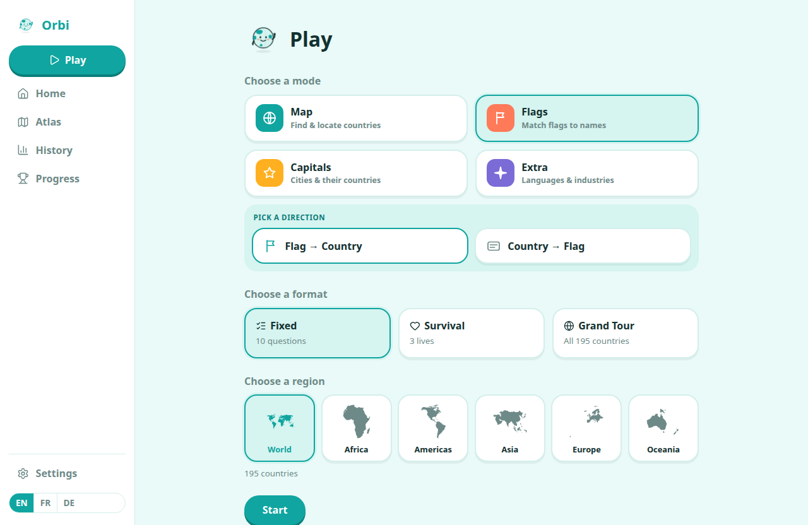
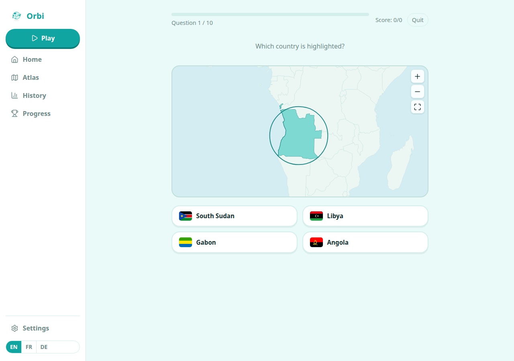
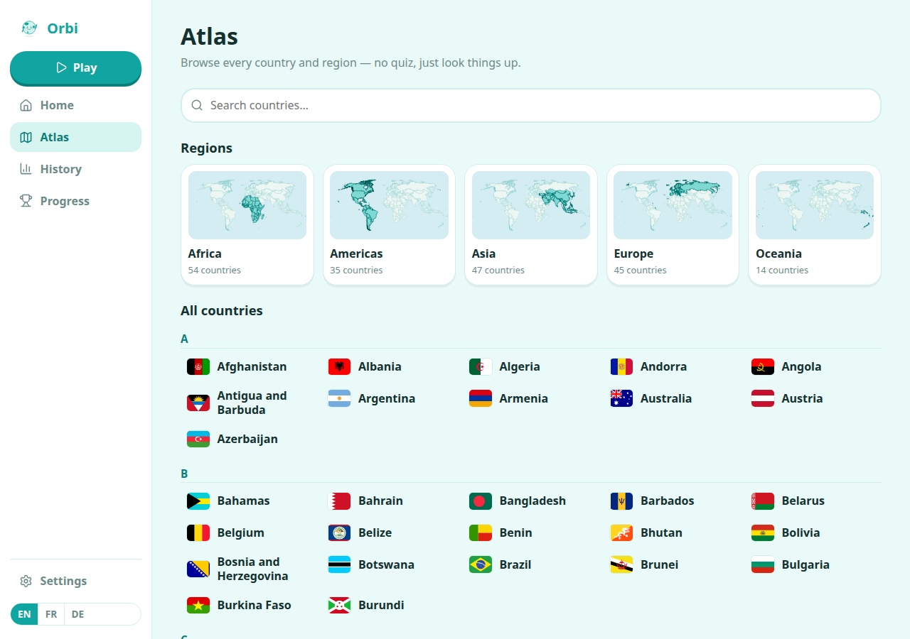
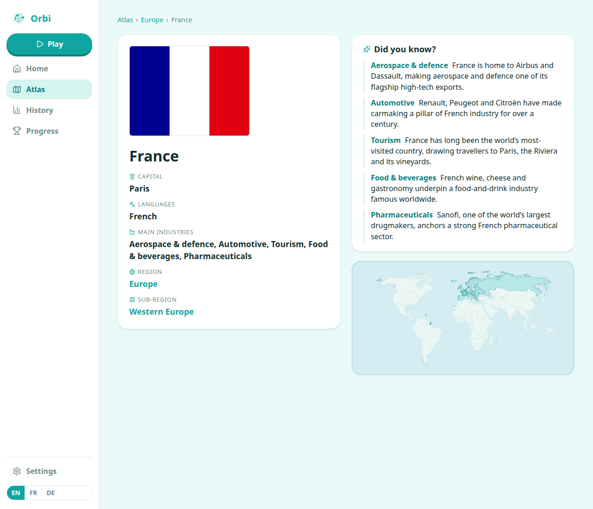
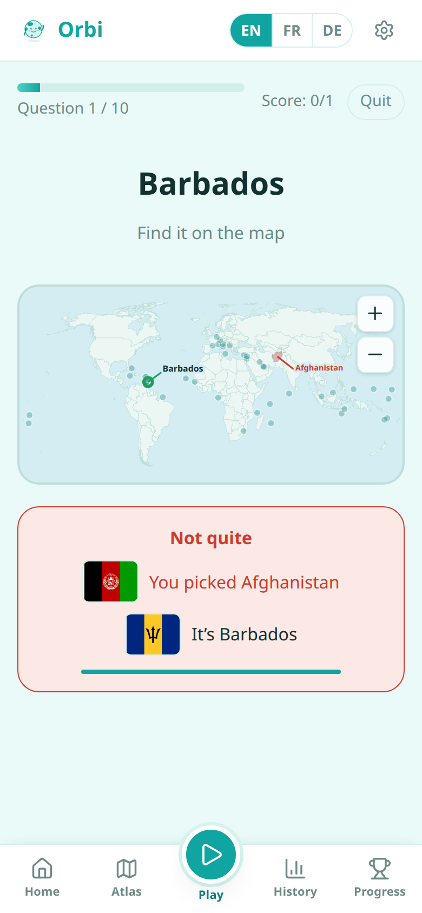

<div align="center">


# Orbi

**Learn the whole world — one map, flag and capital at a time.** 🌍

Orbi is a friendly, offline-first geography game. Meet your globe-shaped guide, pick a corner
of the planet, and quiz yourself on **maps, flags, capitals, languages and industries**. Get one
wrong? Orbi quietly remembers it and brings it back until it sticks.

No account. No backend. No network required after the first load. Just you and 195 countries.

### ▶︎ [**Play it now →**](https://mokaddem.github.io/Orbi/)

[](https://github.com/mokaddem/Orbi/actions/workflows/deploy.yml)
[](https://github.com/mokaddem/Orbi/actions/workflows/ci.yml)
[](LICENSE)


</div>

---

## 🎮 What you can do

- 🗺️ **Find countries on the map** — spot the highlighted one, or drop a pin on the country Orbi names.
- 🚩 **Match flags to names** — both directions, all 195 of them.
- 🏛️ **Guess capitals**, 🈯 **national languages** and 🏭 **main industries**.
- 🎯 **Play your way** — a quick 10, sudden-death **Survival**, or a full **Grand Tour** of a whole region.
- 🌍 **Zoom in anywhere** — the World, one continent, or a single sub-region.
- 🧠 **Train your mistakes** — spaced repetition (SM-2) resurfaces exactly the countries you fumble.
- 🔥 **Build a streak** with a fresh **Daily Challenge**, and collect **achievements** as you go.
- 📈 **Watch mastery grow** — per-region progress, history and weekly recaps.
- 📖 **Browse the Atlas** — every country and region, with a "Did you know?" fact for each.
- 🌐 **Switch language on the fly** — English, French and German, UI *and* country names.
- 📴 **Install it & go offline** — it's a full PWA; after the first visit, everything works with no connection.

## 📸 A quick look

|            Pick a mode, region & format            |        Which country is highlighted?         |
| :------------------------------------------------: | :-------------------------------------: |
|  |  |

|                     Browse the Atlas                     |                  Every country, with facts                  |
| :------------------------------------------------------: | :---------------------------------------------------------: |
|       |        |

<div align="center">
  
  <br/>
  <em>…and it's built for your phone, too.</em>
</div>

## 🚀 Play

The easiest way is to just **[open the live app](https://mokaddem.github.io/Orbi/)** and,
if you like it, hit **Install** in your browser to keep Orbi one tap away — online or off.

### Run it yourself

```sh
git clone https://github.com/mokaddem/Orbi.git
cd Orbi
npm install
npm run dev      # → http://localhost:5180
```

That's it. Want the real, installable, offline build? `npm run build && npm run preview`.

## 📲 Install it on your phone

Orbi is a full PWA, so you can add it to your home screen and play it like a native app —
full-screen and completely offline. On your **first visit from a phone**, Orbi pops up a short
prompt with the exact steps for _your_ device. (It reappears on each reload until you install,
shows only once per visit, and never appears on desktop or once Orbi is already installed.)

You can also do it by hand at any time:

**iPhone / iPad**

1. Tap the **Share** button in the browser toolbar (the box with an up arrow ⬆️).
2. Scroll down and choose **Add to Home Screen**.
3. Tap **Add** — Orbi appears on your home screen.

**Android**

1. Open the browser menu (the **⋮** button). On Chrome you may instead see an **Install**
   banner — just tap that.
2. Choose **Install app** or **Add to Home screen**.
3. Confirm — Orbi appears on your home screen.

Once installed, Orbi launches from its own icon, works with no connection, and updates itself
silently on the next launch.

## 🛠️ Under the hood

A deliberately lean, fully client-side single-page app:

**Svelte 5** + **Vite** + **TypeScript** · **D3-geo** + **TopoJSON** maps · bundled **SVG flags** ·
**IndexedDB** for your progress · **hash routing** so it hosts anywhere static · installable,
Workbox-powered **PWA**. Domain logic (quiz generation, scoring, spaced repetition) is kept pure
and framework-free, covered by a **Vitest** suite (500+ tests).

Curious how it was built? The whole thing was developed phase-by-phase against a product spec —
see [`docs/main_PRD.md`](docs/main_PRD.md).

## 🤝 Contributing

Ideas, bug reports and PRs are welcome! Start with **[CONTRIBUTING.md](CONTRIBUTING.md)** for the
dev setup, project layout and conventions, and please be kind — this project follows a
[Code of Conduct](CODE_OF_CONDUCT.md).

## 📜 License & credits

Code is released under the **[MIT License](LICENSE)** — do what you like with it.

Orbi stands on the shoulders of open data:

- **Flags** — [flag-icons](https://github.com/lipis/flag-icons) (MIT)
- **Map geometry** — [world-atlas](https://github.com/topojson/world-atlas), derived from [Natural Earth](https://www.naturalearthdata.com/) (public domain)
- **Country facts** — [world-countries](https://github.com/mledoze/countries)

Capital, language, industry and "Did you know?" content was curated for this project. See each
upstream project for its own license terms.

<div align="center">
  <sub>Made with 🌍 and a friendly little globe named Orbi.</sub>
</div>
